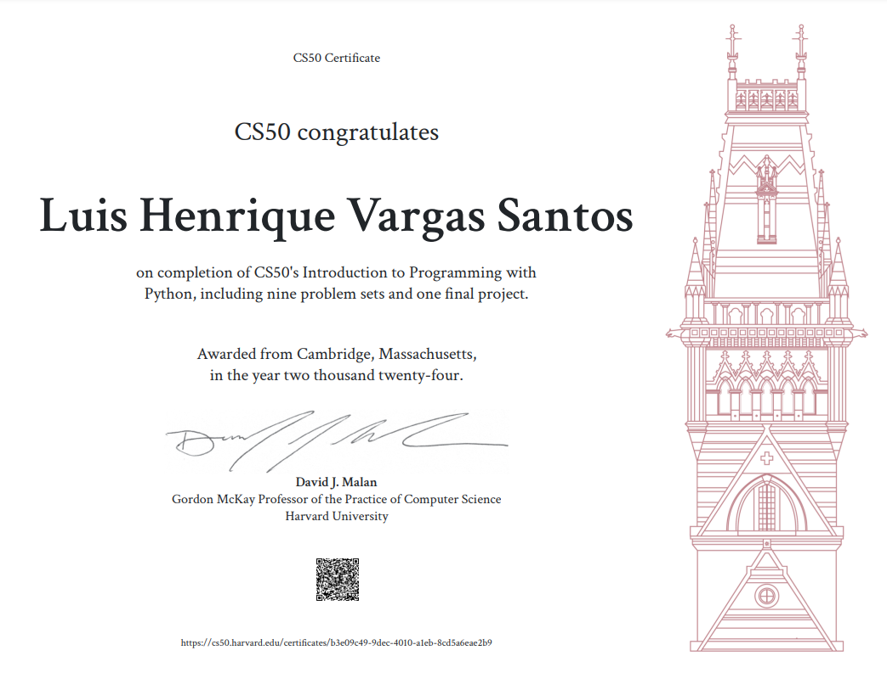

# CS50 Python Course Syllabus

## Final Project
[Final Project](https://github.com/Luishv551/CS50P/tree/main/project)

## Introduction
- Overview
- Tools Used:
  - File Explorer
  - Terminal Window
  - Text Editor
  - Interpreter

## Functions and Variables
- Functions:
  - Parameters (positional, named)
  - Return Values (including `None`)
  - Syntax (`def`, `return`)
  - Comments
- Variables and Types:
  - Assignment (`=`)
  - Types (`str`, `int`, `float`, `bool`)
  - String Methods (`str.*`)
  - Global Variables (`global`)
  - Type Hints?

## Conditionals
- Conditionals, Boolean Expressions
- `if`, `elif`, `else`
- Logical Operators (`or`, `and`, `not`)
- Comparison Operators (`<`, `>`, `==`, `!=`, `<=`, `>=`)
- Sequences:
  - List, Dictionary (for looking up values from keys)
  - Length (`len`) [Consider loops instead?]
  - `range`, `tuple`, `set`
- `match`

## Loops
- Loops (over list and dict)
- `while`, `for`
- `None`
- `break`, `continue`
- List/Dictionary Comprehensions
- `.sort`? Lambda Function for Key?

## Exceptions
- `try`, `except`, `else`, `finally` [Maybe in File I/O?]
- `pass`
- `raise`

## Unit Tests
- `assert`
- Debugging

## Libraries
- Modules
- Packages
- Import
- Standard Libraries:
  - `random`, `statistics`, `sys` (command-line args), `requests` (APIs, HTTP status codes)
- Packages with `__init__.py`

## File I/O
- `os`
- `csv`

## Regular Expressions
- `re`

## Classes
- Classes, Objects/Instances, Methods
- `class`
- Inheritance, Multiple Inheritance
- Properties
- Decorators

## Conclusion

[Notes to Self]
- Additional Ideas for Exercises
- Not Covered
